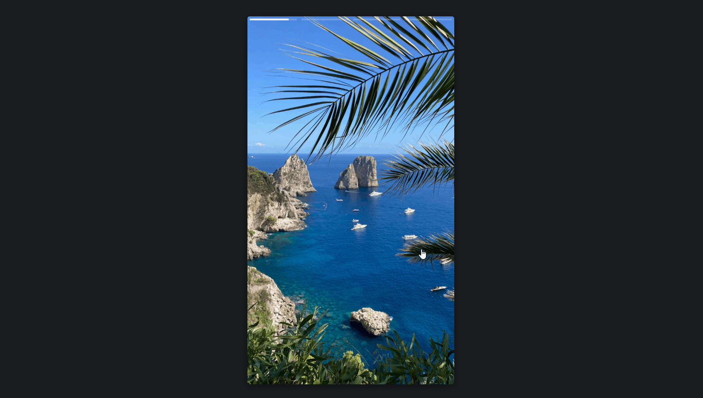

# Slide Stories

Slider of images and videos in Instagram Stories style, created with TypeScript.
This project is an adaptation of one of the projects developed in the TypeScript Course from [Origamid](https://www.origamid.com/curso/typescript-para-iniciantes/), a Brazilian learning platform.

It was a great way to practice TypeScript and also learn more about Pointer Events (pointerdown, pointerup, etc...), which are a modern way to handle input from a variety of pointing devices, such as a mouse, a pen/stylus, and a touchscreen, so the code will work well on multiple devices.

## 🛠️ Technologies

- HTML
- CSS
- JavaScript
- TypeScript

## 🔗 Link

- Live Site URL: [Slide Stories](https://slide-stories-julianachagas.netlify.app/)

## 💻 Preview

 <br/><br/>

## 💡 Features

✔️ Skip forwards, backwards and pause

- Click on the left of the slide to go back to the previous photo or video, or on the right to go to the next one
- Click and hold the screen to pause on a photo or video

✔️ Turn the sound on or off on videos

- Click on the button at the bottom right of the slide to turn the sound on/off. The video always starts muted.

  <table style="width: 30%; border: none;" cellspacing="0" cellpadding="0" border="0">
    <tr>
    <td>Audio is muted</td>
    <td></td>
    </tr>
    <tr>
      <td>Audio is playing</td>
      <td></td>
    </tr>  
  </table>

✔️ The current slide is stored in local storage, so the user can leave/refresh the page and the last seen slide will be loaded when they revisit the page

✔️ Progress bar on each photo/video. If there is no user interruption, it will automatically move to the next photo/video, once the progress bar completes. A photo appears for 3 seconds and a video is played in its entirety.

## ⚙️ How to use

To clone and run this project you'll need [Node.js](https://nodejs.org/en/) and [Git](https://git-scm.com) installed on your computer. In addition, it is good to have an editor to work with the code like [VSCode](https://code.visualstudio.com/). Follow the instructions bellow:

```bash
# Clone this repository
$ git clone https://github.com/julianachagas/slide-stories.git

# Go into the repository
$ cd slide-stories

# Install the dependencies
$ npm install

# Run the app in development mode
$ npm run dev

# Build the app for production to the `dist` folder
$ npm run build

# Preview the production build locally
$ npm run preview

```

## 📚 Useful resources

- Pointer Events: <a href="https://javascript.info/pointer-events" target="_blank">JavaScript Info</a> | <a href="https://developer.mozilla.org/en-US/docs/Web/API/Pointer_events" target="_blank">MDN</a>

## 👩🏻‍💻 Author

<a href="https://www.linkedin.com/in/juliana--chagas/" target="_blank"></a>
<a href="https://twitter.com/JulianaCoding" target="_blank"></a>

---

##### Made with 💜 by Juliana Chagas
